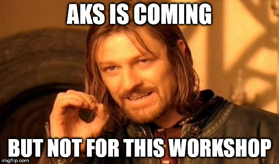
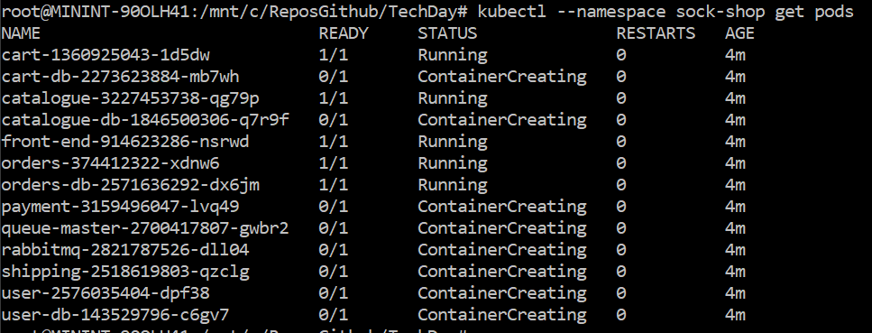

# OSS App Modernisation Hands on Challenge - UK Tech Day


Welcome to the App Modernisation tech day. 

## Tools required

You will require:

* Install the Azure CLI 2.0, get it here - https://docs.microsoft.com/en-us/cli/azure/install-azure-cli
* Install git command line tools, get it here - https://git-scm.com/downloads - Or use the Git for Windows GUI if you're not a grown-up.
* Install Postman, get it here - https://www.getpostman.com - this is optional but useful
* Install Kubectl, get it here - https://kubernetes.io/docs/tasks/tools/install-kubectl or you can use the *az acs kubernetes install-cli* command


When using the Azure CLI, after logging in, if you have more than one subscripton you may need to set the default subscription you wish to perform actions against. To do this use the following command:

```
az account set --subscription "<your subscription guid>"
```

# The Challenges

## Challenge 1 - Install ACS (not AKS) and connect to your cluster

 

### Success Criteria
* You can run the following command against your K8 cluster and see your nodes:

```
kubectl get nodes
```

## Challenge 2 - Deploy the sock shops solution to your cluster

Here we want you to deploy a full multi-tiered solution to Kubernetes so that you can familiarise yourself what a declarative yaml deployment looks like.

### Hints

* You will find the sock shop yaml files inside the SockShop folder. Have at look the various components of the solution and how they are formulated in yaml
* Deploy the objects using:

    ```
    kubectl create -f ./SockShop/
    ```
    ```
    kubectl create -f ./SockShop/deployments
    ```
    ```
    kubectl create -f ./SockShop/services
    ```
    ```
    kubectl create -f ./SockShop/volume
    ```


### Success Criteria

* You can run the following command against your K8 cluster and see your sock shop pods:

```
kubectl --namespace sock-shop get pods
```

 

* You can connect to the sock shop front end

## Challenge 3 - Deploy the capture order container and mongo db

Here we want you to 
1. Deploy a mongoDB single pod using a standard Helm chart
1. Deploy the container *captureordertd*, populating the environment variables and expose the captureordertd container as a public endpoint by using a Service. (*Yaml writing time everyone!  Notepad (or VS Code at the ready)*)


### Hints

See https://hub.docker.com/r/shanepeckham/captureordertd/ for information on the container and what the environment variables look like. You need to map this container over port 8080 as this is where is is listening.

To install MongoDB via Helm use

```helm install --name mongo stable/mongodb```

If you get an error about tiller version, update the HELM version on the server, upgrade using:

```helm init --upgrade```

### Success Criteria

* You can run the following command against your K8 cluster and see your captureordertd external IP:

```
kubectl get svc
```

* You can connect to your Helm installed MongoDB instance and create a record
* You can connect to the captureordertd API via the following uri http://<your svc IP>:8080/swagger
* You can run the Swagger test harness and get a MongoDB orderid as a response
* Your passing your team name into the captureordertd container - you will receive no scores if you do not do this

## Challenge 4 - Deploy the captureordertd container via an HPA

In Kubernetes an HPA is a horizontal scaling unit with which we auto-scale a Deployment based on criteria. Your challenge is to run a load test against the captureordertd endpoint and see your captureordertd pods autoscale.

### Hints

* You must deploy captureordertd as a Deployment object in Kubernetes in order to apply an HPA to it
* You can use the following on cluster container to test the load on your captureordertd Deployment
* You must deploy v2 of the captureordertd

```
kubectl run -i --tty load-generator --image=busybox /bin/sh
```

If it is already running, you can attach to it:

```
kubectl attach <pod> -c load-generator -i -t
```

And then run the following infinite load generation script:

```
while true; do wget -q -O- http://<externalIp or internal DNS>:8080/v1/order/ --post-data "EmailAddress=abc@abc.com"; done
```

Use the following to see your top pod activity

```
kubectl top pods 
```

and to see your pod status as they inflate and deflate

```
kubectl get pods -w
```

### Success Criteria

* You are able to see the multiple pods spawning during the load


## Challenge 5 - Perform a rolling update

We now need to replace MongoDB with CosmosDB, without minimal downtime. Fortunately, we have a MongoDB API driver on CosmosDB. You need to deploy V3 of the captureordertd by means of a rolling update and still be able to capture orders, now in CosmosDB

### Hints

* You must deploy v3 of the captureordertd and replace v2 - see Docker Hub for any info
* You must provision a CosmosDB instance and use the MongoDB API driver

### Success Criteria

* You can see records captured to CosmosDB not MongoDB
* You can see your pods being replaced by the new version
* You can rollback the update - see below

Once you have completed the upgrade, do the following:

To see the status of the rolling update

```
kubectl rollout history deployment captureordertd
```

Now rollback the update using this command

```
kubectl rollout undo deployment captureordertd
```

## Challenge 6 - Perform a rolling update while the system is under heavy load


We now need to replace MongoDB with CosmosDB again, but this time while the system is under heavy load. We want to minimise order loss.

Run the load generator in Challenge 4 while performing the rolling update in Challenge 5

Redeploy your captureordertd:v3 container with the TEAMNAME parameter suffixed with '_LOAD'. We will measure how many records were successfull parsed during the rolling upate

Use this script to run the load:


```
         COUNTER=0
         while [  $COUNTER -lt 1000 ]; do
             wget -q -O- http://<your external ip>:8080/v1/order/ --post-data "EmailAddress=abc@abc.com";
             let COUNTER=COUNTER+1 
         done
```

### Hints

* You need to redeploy V3 of captureordertd again, but are there any parameters you can tweak to improve the throughput? Play with the CPU threshold/throughput parameters and see what you can do to minimise the loss. For example, does it make sense to have numerous pods serving requests or minimising the pod number for the upgrade?

### Success Criteria

* Run an order load of 1000 records, minimise the number of records lost due to failed requests. We will tally the record count, ensure you set the TEAMNAME environment variable correctly on the captureordertd container

## Optional Challenge 7 - Deploy MS SQL Server on Linux on Kubernetes

We now want to deploy SQL Server on Linux on our cluster. To do this you will need to use a Persistent Volume Claim and a Storage Class. 

### Hints

* Create a Storage Class

    Use storage.k8s.io/v1beta1. 
    If you created the cluster with managed disks you must use managed as the StorageClass kind. If your Agents are using Storage Accounts for DataDisks then you must use shared as the StorageClass kind.

* Create the Persistent Volume Claim

    You need to add the annotation to the Persistent Volume Claim definition. You need to specify storageClassName on specification.

* Deploy the microsoft/mssql-server-linux container with the volume /var/opt/mssql mounted from the PersistentVolumeClaim you created.

* The mssql container requires 3 environment variables; ACCEPT_EULA with a value of Y, MSSQL_SA_PASSWORD with a value of a complex password, and MSSQL_PID with a value of Developer

* Exec into your container to run SQL commands
```
kubectl exec -it <pod> -- /bin/bash
```

* Use sqlcmd to create a new database and a new table and insert some data into the table.

    Go to the bash shell of your mssql pod
    Connect to your service instance on port 1433
    ```
        /opt/mssql-tools/bin/sqlcmd -S <IP_OF_SERVICE>,1433 -U SA -P '<YourPassword>'
    ```
    At the sqlcmd prompt create a new database
    ```
        CREATE DATABASE TestDB
    ```
    Verify the table was created
    ```
        SELECT Name from sys.Databases
    ```
    Execute the above commands
    ```
        GO
    ```
   
    Exit the sqlcmd tool
    ```
        QUIT
    ```

### Success Criteria

* You can successfully create record in your SQL server and see the storage created within Azure


## Optional Challenge 8 - Add throttling to your API

Add throttling to your API endpoint to only 60 requests per minute from a single IP

### Hints

* Use either Azure API Management, Kong or Logic Apps to do this

### Success Criteria

* You successfully throttle requests at 60 per minute from a single IP

## Optional Challenge 9 - Add an event driven email notification to your order

You must send an email notification to a recipient in the Email Address of the order but you must use an event binding on CosmosDB to trigger the email.

### Success Criteria

An email is sent to a recipient as triggered from a record created in CosmosDB

## Optional Challenge 10 - Add a presentation layer to the API

Add a presentation layer to the API,

### Success Criteria

An order can be placed successfully from a presentation layer


## Command cheat sheet

###Create AKS Cluster
```
az acs create --orchestrator-type kubernetes --resource-group <yourresourcegroupk8> --name <yourk8cluster> --generate-ssh-keys
```

###Install Kubectl
```az acs kubernetes install-cli``

###Get Creds for K8s
```az acs kubernetes get-credentials --resource-group=<yourresourcegroupk8> --name=<yourk8cluster>```

###Check it's all working
```kubectl get nodes```

###Browse k8s dashboard

```az acs kubernetes browse -g <yourresourcegroupk8> -n <yourk8cluster>```

###Zip up ssh from cloudshell
```zip -q -9 -j ~/clouddrive/sshkeys3.zip ~/.ssh/*```

###Pull in the ssh files into linux subsystem for windows10

    7  cd /
    8  ls
    9  cd mnt
    10  cd c
    11  ls
    12  cd Users
    13  ls
    14  cd gobyers
    15  ls
    16  cd Downloads
    17  ls
    18  cd sshkeys2
    19  ls
    20  cp -rf * ~/.ssh/

###Install Helm
```
apt install linuxbrew-wrapper
brew install kubernetes-helm
```

####Or if that messes up
```
curl https://raw.githubusercontent.com/kubernetes/helm/master/scripts/get > get_helm.sh
chmod 700 get_helm.sh
./get_helm.sh
```

###Test mongoDb post install
```
kubectl run mongo-mongodb-client --rm --tty -i --image bitnami/mongodb --command -- mongo --host mongo-mongodb
```

###Test out by using some simple commands
```
    show db
    cosmos = { title:"CosmosDb", category:"Database", url:"https://docs.microsoft.com/en-us/azure/cosmos-db/introduction" }
    azuredb = { title:"AzureDb", category:"Database", url:"https://azure.microsoft.com/en-us/services/sql-database/" }
    db.azureservices.save(cosmos)
    db.azureservices.save(azuredb)
    db.azureservices.find()
```


###Run the ReplicationSet Yaml

###Run the Services Yaml

###Open the swagger page on the new External IP - Submit an order
http://<your external ip>:8080/swagger/


###Log back into mongo and check for the data

    > db
    test
    > use k8orders
    switched to db k8orders
    > show collections
    orders
    > db.orders.find()
    { "_id" : ObjectId("5a1d8b8faad9887d8fcc124a"), "id" : "5a1d8b8f354a8b004699ab89", "emailaddress" : "test@test.com", "preferredlanguage" : "en-gb", "product" : "balls", "total" : 1, "source" : "swagger", "status" : "Open" }


## Troubleshooting

####HELM refused to work, because of version Mismatch
    helm incompatible versions client[v2.7.2] server[v2.5.1]
>helm init --upgrade


####ERROR: Helm init --upgrade doesn't work
    @@@@@@@@@@@@@@@@@@@@@@@@@@@@@@@@@@@@@@@@@@@@@@@@@@@@@@@@@@@
    @         WARNING: UNPROTECTED PRIVATE KEY FILE!          @
    @@@@@@@@@@@@@@@@@@@@@@@@@@@@@@@@@@@@@@@@@@@@@@@@@@@@@@@@@@@
    Permissions 0777 for '/root/.ssh/id_rsa' are too open.
    It is required that your private key files are NOT accessible by others.
    This private key will be ignored.
    Load key "/root/.ssh/id_rsa": bad permissions
    Permission denied (publickey).

> chmod 600 /root/.ssh/id_rsa

> ssh azureuser@k8scheapcl-k8scheap-2d5bb2mgmt.westeurope.cloudapp.azure.com sudo sed -i s/'2.5.1'/'2.7.2'/g /etc/kubernetes/addons/kube-tiller-deployment.yaml && helm init --upgrade
    
    $HELM_HOME has been configured at /root/.helm.
    Tiller (the Helm server-side component) has been upgraded to the current version.
    Happy Helming!


####ERROR: Can't retrieve the Server version of HELM after upgrade
    root@MININT-90OLH41:~# helm version
    Client: &version.Version{SemVer:"v2.7.2", GitCommit:"8478fb4fc723885b155c924d1c8c410b7a9444e6", GitTreeState:"clean"}
    Error: cannot connect to Tiller

>REBOOT THE VM's!