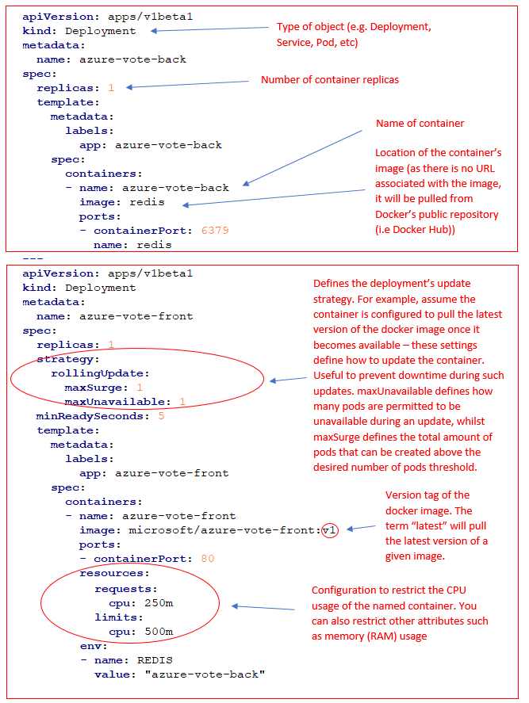
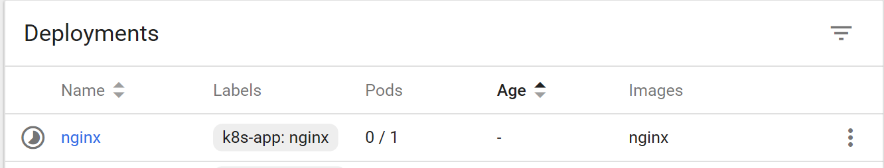

# Azure Container Service - Kubernetes Lab.  Level 200-250

## Origin Story
Forked from https://github.com/shanepeckham/UKTechDay---OSS-App-Modernisation which was a Level 400 version.
This Level 200-300 lab works up the basics a little slower.

## Tools required
Exercises 1-6
* Azure Cloud Shell (Bash version) (It's built into the Azure Portal, nothing to install!)

Exercises 7-10
* Bash on a linux OS (or the Linux subsystem for Windows 10)

## Caveats
No Windows, no GUI's.  By that i mean you can of course use the Windows OS, but please use either the
1. Linux subsystem for Windows 10
1. A Linux VM inside Hyper-V.

If you really want to use the Powershell on Windows 7, go for it... But you'll be going off-lab and will likely have issues to resolve that aren't covered in this guide.

## Exercise 1 - Creating a Kubernetes Cluster in Azure.
At the time of writing, ACS (Azure Container Service) is the recommended option, not AKS which is still in preview.
There are 2 main ways of creating an ACS Cluster.
1. In the Azure Portal GUI
1. Using the Azure CLI

My preference is the *Azure CLI* because it generates the SSH keys for you as well as the service principal.  The easiest way to use the Azure CLI is in Cloud Shell in the Azure Portal. 
Feel free to use the Portal GUI to create the service, but you're going off-lab (but just a little bit so don't worry too much.

Lets open the Cloud Shell.  

> https://portal.azure.com

Login and then click the Cloud Shell icon

 

You'll then see the Cloud Shell open at the bottom of the screen.

Alternatively, open the cloud shell in it's own window
> https://shell.azure.com/

Copy and paste this script into the Cloud Shell.  It'll do 3 things;
1. Create a resource group called K8S in eastus.
1. Create a ACS cluster with a few specific options set.  You don't have to provide half of these, but i quite like the new B- so we're setting that up.  The default would have been a D2_V2 VM for both agent and master VM's that get created.  It also would have been 3 agents, but 1 is enough for the time being.

    ```
    az group create --name K8s --location eastus
    az acs create --orchestrator-type kubernetes --resource-group K8s --name K8sCluster --generate-ssh-keys --agent-count=1 --agent-vm-size=Standard_D2_v2 --agent-osdisk-size=32 --agent-storage-profile=ManagedDisks --master-vm-size=Standard_B1s
    az acs kubernetes get-credentials --resource-group=K8s --name=K8sCluster 
    ```

This takes between 10 and 30 minutes to provision.  So lets use this time to watch the Illustrated Children's Guide to Kubernetes.
If you haven't seen this, watching it will take 8 minutes and it does the best job of talking about the Kubernetes constructs that i've seen.  If you have already seen it, i'd encourage a second watch just to let everything sink in.

[](https://www.youtube.com/watch?v=4ht22ReBjno  "Illustrated Children's Guide to Kubernetes")


### Post creation
After the cluster has been created, in the Azure Portal find the resource group and open it up.  You'll see a lot of Azure services have been created.  It's important to realise that we have
1. A new vNet
1. VM's, not VM Scalesets
1. A bunch of other infrastructure services

 

## Exercise 2 - kubectl 
Kubectl is the main tool you're going to use to manage your kubernetes cluster.  It comes pre-installed in the Azure Cloud Shell, which is awesome. 

So lets have a look at a basic command that will tell us about the VM's.

```kubectl get nodes```

 

Lets run a couple of other common commands.

```kubectl cluster-info```

 

```kubectl version```

 

## Exercise 3 - Creating a simple deployment
We're going to use a YAML file from the Azure Quickstarts.
The YAML file declaratively states the container name location and any other supporting Kubernetes resources needed.  We'll examine the YAML later.

    ```
    mkdir ~/clouddrive/acs-yaml
    cd ~/clouddrive/acs-yaml
    curl -O https://raw.githubusercontent.com/Azure-Samples/azure-voting-app-redis/master/azure-vote-all-in-one-redis.yaml
    kubectl create -f azure-vote-all-in-one-redis.yml
    ```

Once this has created, lets use the following commands to see what's been created ```kubectl get pods``` ```kubectl get svc ```

 
    
We have 2 containers and 2 services.  One of the services is internally exposed, the other will receive a public ip address.
If you use the command ```kubectl get svc -w``` the command console will watch for changes and report them.  So when a public ip address is created in Azure, it'll appear in the console window.

It's important to realise that an actual public ip address has been created
 

You can hit this IP address in a browser and interact with the web app that's been created.

## Exercise 4 - YAML
Typically, you would have two types of yaml files to help Kubernetes understand what your applications consist of and how they would operate. These two files would be the deployment and services yaml file. Let's drill down into what roles they have with k8s:

Deployment: According to Kubernetes documentation, the definition of deployment(s) is "You describe a desired state in a Deployment object, and the Deployment controller changes the actual state to the desired state at a controlled rate". In my own words, deployments let you define parameters such as how many replicas your applications will have (how many copies of the container will be spun up for the application), the docker image location of your container and the name of it.  Let's review the two deployment configurations (the azure vote frontend and backend apps) from the yaml file you deployed earlier:

 


## Exercise 5 - Autohealing

Run this command and see what pods you have running

    ```
    kubectl get pods
    ```

Now delete the pod
    ```
    kubectl delete pod NameOfYourPod
    ```
Run this command again and see what's reported
    ```
    kubectl get pods -w
    ```
I'm expecting that your pod has gone, but a very similarly named one has been put in it's place.
TA-DA.  Autohealing!

 

## Exercise 7 - Contexts, moving and sharing.

By now, we're all bored of Cloud Shell, sure it's nice and easy.. But every time you go for a coffee, it times out - and we need to consider accessing this from somewhere else.

### Contexts
Let's see what contexts are configured.  I've got a tonne, but hopefully you'll just have 1 for the cluster we created in Exercise 1.

    kubectl config view

Now, in the Cloud Shell lets look at where this is kept
    ```cd ~/.kube/```
    ```ls```

You should have *config-K8sCluster-1* listed.
Lets copy that out somewhere safe where we can grab it.
    ```zip -q -9 -j ~/clouddrive/kubeconfig-$(date +%F).zip config-K8sCluster-1```

In the Cloud Shell, lets see where these files are stored.  Click on the *settings* cog and then *Manage File Share* - a new browser window will open in Azure Files where you can easily navigate to the directory with the kubeconfig zip file in it to download to your machine.

### SSH Keys
We should backup the SSH keys that were generated when we created the cluster.  You'll need these kept somewhere safe when your running K8S in a real environment.

    zip -q -9 -j ~/clouddrive/sshkeys-$(date +%F).zip ~/.ssh/*

In the same way as you downloaded the config zip, do the same for the ssh key zip.

### Installing Kubectl
We need to install Kubectl into your local linux environment.
Follow the appropriate instructions here : https://kubernetes.io/docs/tasks/tools/install-kubectl/

### Copying in the config
Copy it to the directory /.kube on your machine, it should exist if you instal kubectl. 
Now to connect to the cluster run the folling command

```kubectl --kubeconfig ./<your cluster config file> get nodes```

And now make yourself an alias for brevity:

```alias k8='kubectl --kubeconfig ./<your cluster config file>'```

Now you can run the following command:

```k8 get nodes```


## Exercise 8 - Accessing the dashboard
Kubernetes has a web dashboard, who knew!
Lets have a look

```az acs kubernetes browse -g K8S -n K8SCluster```

 

## Exercise 9 - Creating a deployment in the Dashboard GUI
From within the dashboard, go create then complete the details as per screenshot.
 



Let's back out of the dashboard and run these commands to see what's been created.

> kubectl get pods
>
> kubectl get svc

## Exercsie 10 - Helm
Helm is a package manager for Kubernetes.  It will simply allow the installation of complex software using *Helm Charts* (are you noticing a terminology theme yet :)).

Please read the introduction section through to the installation section here : https://github.com/kubernetes/helm

Once installed, initialise it.  This will install a tiller pod into the cluster.

> helm init

Now lets have a quick look at all the things we could install with Helm

> helm search

The syntax for installing a package is 

> helm install --name my-blog stable/wordpress


## Troubleshooting Tips

#### Inspect pod logs
    kubectl logs thenameofyourpod

#### HELM refused to work, because of version Mismatch
    helm incompatible versions client[v2.7.2] server[v2.5.1]
> helm init --upgrade


#### ERROR: Helm init --upgrade doesn't work
    @@@@@@@@@@@@@@@@@@@@@@@@@@@@@@@@@@@@@@@@@@@@@@@@@@@@@@@@@@@
    @         WARNING: UNPROTECTED PRIVATE KEY FILE!          @
    @@@@@@@@@@@@@@@@@@@@@@@@@@@@@@@@@@@@@@@@@@@@@@@@@@@@@@@@@@@
    Permissions 0777 for '/root/.ssh/id_rsa' are too open.
    It is required that your private key files are NOT accessible by others.
    This private key will be ignored.
    Load key "/root/.ssh/id_rsa": bad permissions
    Permission denied (publickey).

> chmod 600 /root/.ssh/id_rsa

> ssh azureuser@k8scheapcl-k8scheap-2d5bb2mgmt.westeurope.cloudapp.azure.com sudo sed -i s/'2.5.1'/'2.7.2'/g /etc/kubernetes/addons/kube-tiller-deployment.yaml && helm init --upgrade
    
    $HELM_HOME has been configured at /root/.helm.
    Tiller (the Helm server-side component) has been upgraded to the current version.
    Happy Helming!


####ERROR: Can't retrieve the Server version of HELM after upgrade
    root@MININT-90OLH41:~# helm version
    Client: &version.Version{SemVer:"v2.7.2", GitCommit:"8478fb4fc723885b155c924d1c8c410b7a9444e6", GitTreeState:"clean"}
    Error: cannot connect to Tiller

>REBOOT THE VM's!
